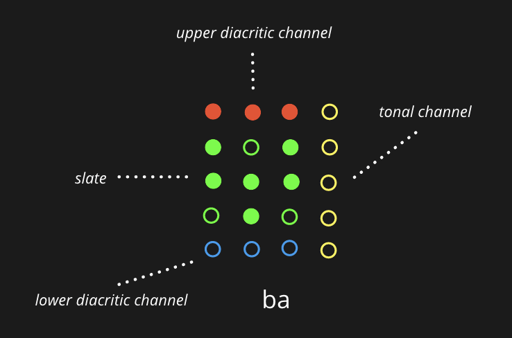
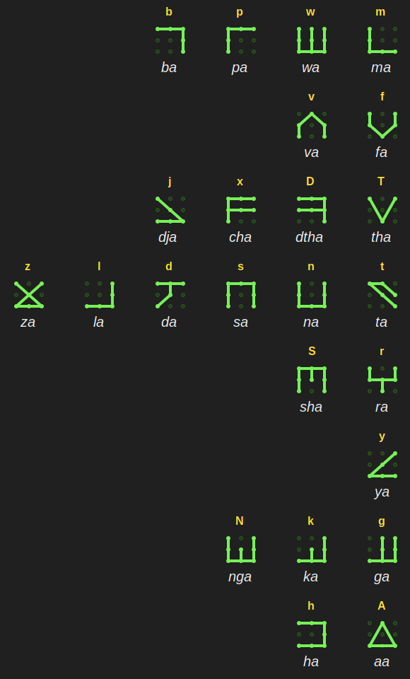
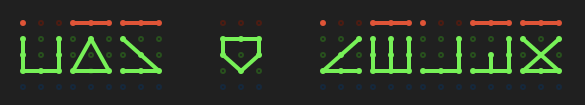
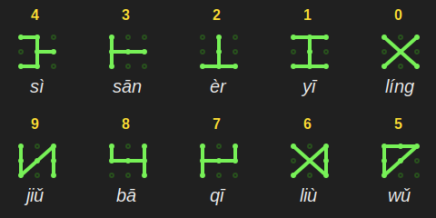
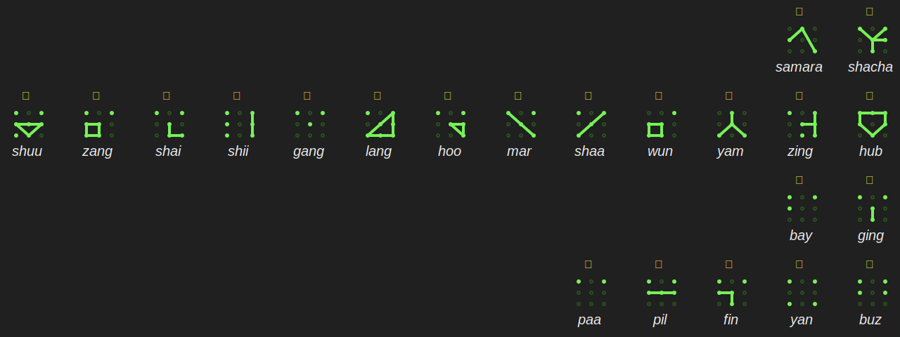
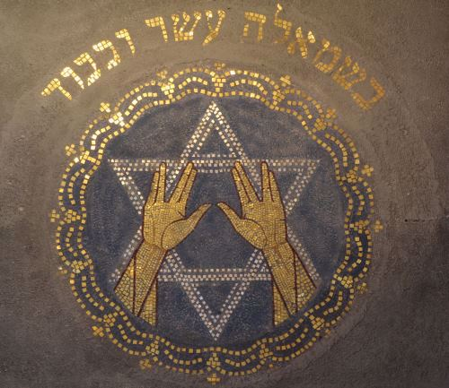
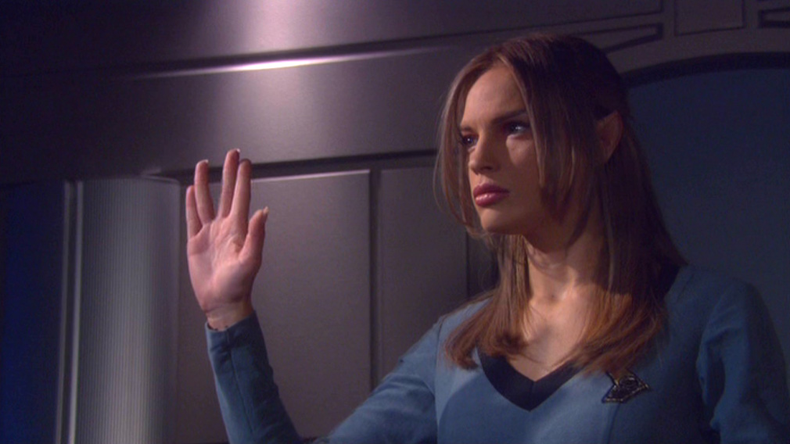

# Tonal Marain: Language of the Culture
Tonal Marain is a language consciously designed as a comprehensive and inclusive system for communicating cultural and scientific information. Marain was created during the formative years of the Culture, when its essential identity was still in flux. Tonal Marain adds a channel for adding emotional content through five tones (due to Marain's partial origin in [Mandarin Chinese](https://en.wikipedia.org/wiki/Mandarin_Chinese)).

## Glyphs and Encoding
Marain is a binary language. Each glyph is a representation of a binary number created by arranging the bits within a multi-dimensional container. Different strata of Marain use different byte sizes, with a commensurate increase in the number of possible unique symbols. Byte size, and the number of dimensions a glyph may be constructed in, are limited only by computational resources. In practice, the more complex strata of Marain (using very long bytes and multi-dimensional symbols) are only used by and comprehensible to machine intelligences like Minds. Glyphs may be used to represent a wide range of data, including musical notation and arbitrary symbols and pictograms.

## Marain in Fiction
In the fictional Culture book series, Marain is designed to be clear, concise and as unambiguous as technically feasible. The Culture uses its standard nonary encoding and primary glyph set to express its form of Marain. Each primary glyph represented a phoneme, with rotated symbols representing either similar phonemes or different vocalizations. It has a phoneme to denote upper case. The range of represented phonemes is intended to allow the replication of nearly any pan-human language. While Marain is the predominant language in the Culture, it also has significant use outside of the Polity.

## Early Attempts to Create Marain on Earth
An early version of Marain was created by Reddit users [u/comradelenin456](https://www.reddit.com/r/TheCulture/comments/flcbc0/i_want_to_learn_marain) and [u/ratioprosperous](https://www.reddit.com/r/TheCultureFanFic/comments/85lmvb/review_of_a_prologue_by_uratioprosperous_from_a) using the alphabet from _A Few Notes On Marain_ (see [r/marain](https://www.reddit.com/r/Marain)). It is a synthetic language with such features as flexible word order, no tenses, six grammatical cases, fourth-person pronouns, and genderless third-person pronouns. Though it has recognition within Reddit and has been used to make tattoos, this language is non-canonical.

[Marain romanization to symbols and English gloss](https://marain-tools.netlify.app)

## Tonal Marain
Fiction aside, in reality Marain uses a structured lattice to encode emotional content. The underlying [2D lattice](https://www.google.com/search?q=2D+lattice) in tonal Marian is a 4x5 grid of dots.

The lattice is divided into four areas. The _upper diacritic channel_ (red – for vowels), the _lower
diacritic channel_ (blue – also for different vowels) and the _tonal channel_ (right, in yellow) and
finally the main area of the glyph, the 3x3 _slate_ shown in green above. The slate encodes both
graphemes (i.e., phonemes such as letters in English) and logograms (complete words as
letters, such as in Chinese). Therefore Marain (in combination with Bootstrap Min) is a
universal script – it can encode anything. And if it can’t, is adaptable enough to encode new
language protocols (essentially you can change the language and symbols within the language
itself – it all gets a bit meta when machines talk to each other through rapid communication)

## Optimized High-Frequency Speech

Marain does not have an alphabet, but instead has 24 characters that form an [abjad](https://en.wikipedia.org/wiki/Abjad). Tonal Marain does not have an alphabet due to its origins in Modern Marain. Like [Modern Hebrew](https://en.wikipedia.org/wiki/Modern_Hebrew), Modern Marain is read from right to left and has symbols for phonemic consonants and long vowels (an impure abjad). Shorter vowels are indicated by diacritics in the upper and lower diacritic channels.

Marain has been engineered for rapid high-frequency communication between minds and pan-humans. To do this, careful study and attention has been given to the mouth movements of pan-human organics, including the use of the tongue, throat, and teeth when speaking at high-frequency, to minimize activating the motor cortex as much as possible (yes, we care about your neural network and want to make things as simple as possible for you). Long story short – if you speak Marain it will take less energy to move your tongue around in your mouth, so you can speak a lot faster (that doesn’t mean you can understand things faster though).

For this reason, the Marain abjad is organized first by [place of articulation](https://en.wikipedia.org/wiki/Place_of_articulation) and then by phoneme frequency. Without diacritics, the default short vowel on a consonant is _a_, so for example _b_ is read _ba_ unless overridden by upper or lower diacritics. The eight place of articulation groups that make up the Marain abjad are:

* bilabial (_ma_, _wa_, _pa_, _ba_)
* labio-dental (_fa_, _va_)
* interdental (_tha_, _dtha_, _cha_, _dja_)
* alveolar (_ta_, _na_, _sa_, _da_, _la_, _za_)
* post-alveolar (_ra_, _sha_)
* palatal (_ya_)
* velar (_ga_, _ka_, _nga_)
* glottal (_aa_, _ha_)

## Diacritics and Short Vowels

Similar to Semitic languages such as Arabic, Hebrew and Aramaic, Tonal Marain uses diacritics above and below letters to indicate short vowels.  The four short vowels are:

* _up_ (a bar above a letter) for the short vowel _a_ /æ/
* _out_ (a dot above the start of the letter) for the short vowel _u_ /ʊ/
* _down_ (a bar below a letter) for the short vowel _i_ /ɪ/
* _stop_ (a dot above the end of the letter) for a [zero vowel](https://en.wikipedia.org/wiki/Zero_(linguistics))

Diacritics are optional on scripts in Tonal Marain, once vocabulary has been learnt. The script below is a translation of the English sentence _Zalakwe loves Djan_
 into Marain, showing the underlying glyph lattice.

[Click here](http://ipa-reader.xyz/?text=zakalwe%C9%AA%20hub%20%CA%A4a%CB%90n&voice=Joanna) to listen to an AI read the above Marain text, from right to left, with diacritics for short vowels.

## Hindu-Arabic Numeral System

Numbers are the only real universal language. The [decimal system](https://en.wikipedia.org/wiki/Hindu%E2%80%93Arabic_numeral_system) on Earth has been propagated even more widely than the Phoenician alphabet and has now become the only real universal language on the planet. Every human on Earth who can read understands how to read the same decimal digits, regardless of their culture or origin.

Hindu-Arabic numerals are the set of ten symbols that represent numerals in the decimal number system. They originated in India in the 6th or 7th century and were introduced to Europe by Islamic mathematicians, especially the Persian polymath [al-Khwarizmi](https://en.wikipedia.org/wiki/Muhammad_ibn_Musa_al-Khwarizmi), the founder of algebra, and hence the father of all modern mathematics, science and programming found on the planet today. At it's core, coding is just another form of algebra or calculus.

Decimal numbers in Marain are written from right to left using the digits shown above. The names of the numerals from zero to nine in Tonal Marain are the same as in Mandarin Chinese. However, the subsequent numbering system does not follow Mandarin, only the digit names are used.

## Nonverbal Communication: Body Language and Emotional Intelligence

It is well known that most humans trust forms of nonverbal communication over verbal communication, and in fact nonverbal communication accounts for up to 70% of all human communication globally.  Tonal Marain has 22 glyphs to express body language. The use of emoting glyphs is encouraged, as these aid with conveying additional contextual information to the listener.

The Marain glyphs in the image below are shown together with equivalent Unicode code points, grouped into four categories:

* logical signals (_shacha_, _samara_)
* positive emotional signals (_hub_, _zing_, _yam_, _wun_, _shaa_, _mar_, _hoo_, _lang_, _gang_, _shii_, _shai_, _zang_, _shuu_)
* necessary emotional signals (_ging_, _bay_)
* negative emotional signals (_buz_, _yan_, _fin_, _pil_, _paa_)

### Logical Signals

1. _shacha_ (🖖): greetings, prosperity, peace, harmony, completeness, tranquillity, hello, bye

2. _samara_ (🤨): fascination, logic understood

### Positive Emotional Signals

3. _hub_ (💛): love
4. _zing_ (✨): positivity
5. _yam_ (🙏): hope
6. _wun_ (💕): warmth
7. _shaa_ (🤣): laughter
8. _mar_ (😂): joy
9. _hoo_ (😊): happiness
10. _lang_ (🥰): romance
11. _gang_ (😘): affection
12. _shii_ (😉): synchronicity
13. _shai_ (👍): agreement
14. _zang_ (😲): surprise
15. _shuu_ (😍): infatuation

### Necessary Emotional Signals

16. _ging_ (🥺): sympathy
17. _bay_ (😢): sadness

### Negative Emotional Signals

18. _buz_ (😭): overwhelmed
19. _yan_ (🤢): disgust
20. _fin_ (😡): anger
21. _pil_ (🥱): fatigue
22. _paa_ (😨): fear